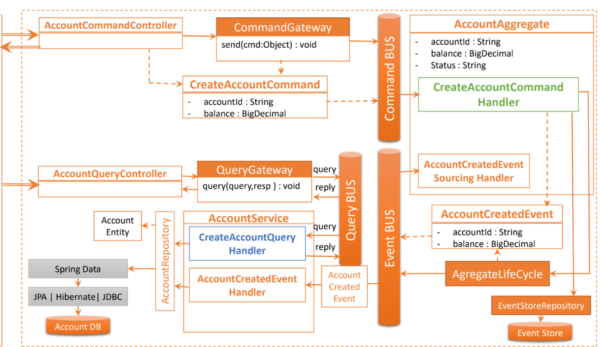
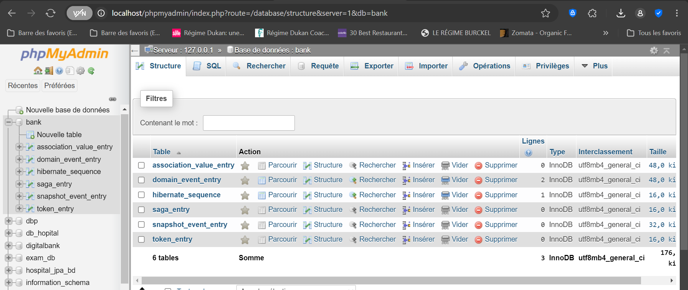

# TP :  Gestion de Comptes Bancaires avec CQRS et Event Sourcing

Cette application  est un exemple de microservice développé avec Spring Boot et le framework Axon pour gérer des comptes bancaires en respectant les patterns CQRS et Event Sourcing.

---
## Objectifs

1. **Mettre en place les patterns CQRS et Event Sourcing.**.
2. Utiliser Axon Framework pour la gestion des commandes, événements et projections.
3. Implémenter une architecture scalable et maintenable.
4. Tester avec un client REST comme Postman.

## Technologies utilisées

- Spring Boot
- Axon Framework
- Spring Data JPA
- Base de données H2
- Spring Web
- Lombok
- Spring Doc OpenAPI UI

## Étapes du TP

### 1. Initialisation du projet

Créer un projet Spring Boot avec les dépendances suivantes :
- **Spring Web**
- **Spring Data JPA**
- **Spring Data REST**
- **H2 Database**
- **Lombok**
- **Spring GraphQL**
- **Springdoc OpenAPI UI**

## 2. Architecture du projet
Le projet est organisé selon les modules principaux :

Command Side : gestion des commandes et envoi d'événements.


Query Side : gestion des requêtes et projections.

## 3. Structure du projet

Le projet est organisé selon l'architecture suivante :


## 4. Implémentation des commandes et événements
Exemple de Commande

```java
package maryam.nfad.comptecqrses.commonApi.commands;

import lombok.Getter;

public class CreateAccountCommand extends BaseCommand<String>{

    @Getter private double initialBalance;
    @Getter private String currency;

    public CreateAccountCommand(String id, double initialBalance, String currency) {
        super(id);
        this.initialBalance = initialBalance;
        this.currency = currency;
    }


}

```

Exemple d'Événement

```java
package maryam.nfad.comptecqrses.commonApi.events;

import lombok.Getter;
import maryam.nfad.comptecqrses.commonApi.enums.AccountStatus;

public class AccountCreatedEvent extends BaseEvent<String>{
    @Getter private double initialBalance;
    @Getter private String currency;
    @Getter private AccountStatus status;

    public AccountCreatedEvent(String id, double initialBalance, String currency, AccountStatus status) {
        super(id);
        this.initialBalance = initialBalance;
        this.currency = currency;
        this.status = status;
    }
}

```
## 5. Gestion des agrégats
Les agrégats représentent l'état des entités et gèrent la logique métier.
Exemple d'Agrégat
```java

@Aggregate
public class AccountAggregate {


    @AggregateIdentifier //Affecter automatiquement
    private String accountId;
    private double balance;
    private String currency;
    private AccountStatus status;

    public AccountAggregate(){
        // Required by AXON
    }

    @CommandHandler
    public AccountAggregate(CreateAccountCommand createAccountCommand) {
        if (createAccountCommand.getInitialBalance() < 0) throw new RuntimeException("Impossible ... ");
        //OK
        AggregateLifecycle.apply(new AccountCreatedEvent(
                createAccountCommand.getId(),
                createAccountCommand.getInitialBalance(),
                createAccountCommand.getCurrency(),
                AccountStatus.CREATED
        ));
    }


    @EventSourcingHandler
    public void on(AccountCreatedEvent event){
        this.accountId=event.getId();
        this.balance=event.getInitialBalance();
        this.currency=event.getCurrency();
        this.status=AccountStatus.CREATED;
        AggregateLifecycle.apply(new AccountActivatedEvent(
                event.getId(),
                AccountStatus.ACTIVATED
        ));

    }
    @EventSourcingHandler
    public void on(AccountActivatedEvent event){
        this.status=event.getStatus();

    }
    @CommandHandler
    public void handler(CreditAccountCommand command){
        if(command.getAmount()<0) throw new AmountNegativeException("Amount should not be negative");
        AggregateLifecycle.apply(new AccountCreditedEvent(
                command.getId(),
                command.getAmount(),
                command.getCurrency()

        ));
    }
    @EventSourcingHandler
    public void on(AccountCreditedEvent event) {
        this.balance += event.getAmount();
    }


    @CommandHandler
    public void handler(DebitAccountCommand command){
        if(command.getAmount()<0) throw new AmountNegativeException("Amount should not be negative");
        if(this.balance<command.getAmount()) throw new BalanceNotSuffcientException("Balance not sufficient => "+balance);
        AggregateLifecycle.apply(new AccountDebitedEvent(
                command.getId(),
                command.getAmount(),
                command.getCurrency()

        ));
    }
    @EventSourcingHandler
    public void on(AccountDebitedEvent event) {
        this.balance -= event.getAmount();
    }

}

```
## 5. Gestion des requêtes et projections

Les projections permettent de matérialiser l'état actuel des données à partir des événements.

Exemple de Projection

## 6. Configuration de l'application
```
application.properties
spring.application.name=compte-service
spring.datasource.url=jdbc:mysql://localhost:3306/bank?createDatabaseIfNotExist=true
spring.datasource.username=root
spring.datasource.password=
spring.jpa.hibernate.ddl-auto=update
spring.jpa.properties.hibernate.dialect=org.hibernate.dialect.MariaDBDialect
server.port=8082
```

## EventStore Data Base :


## Test : 


